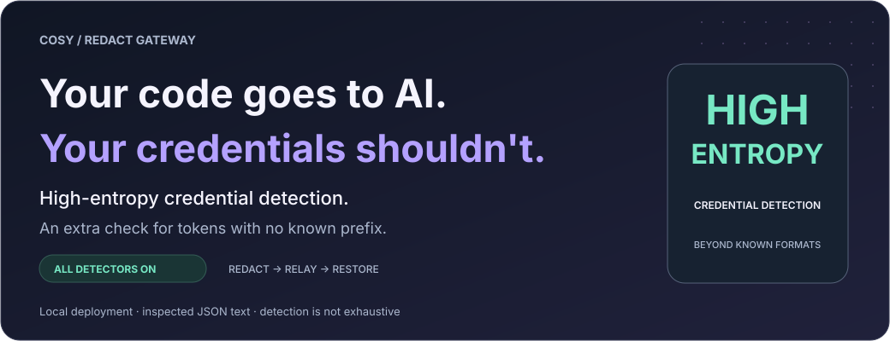
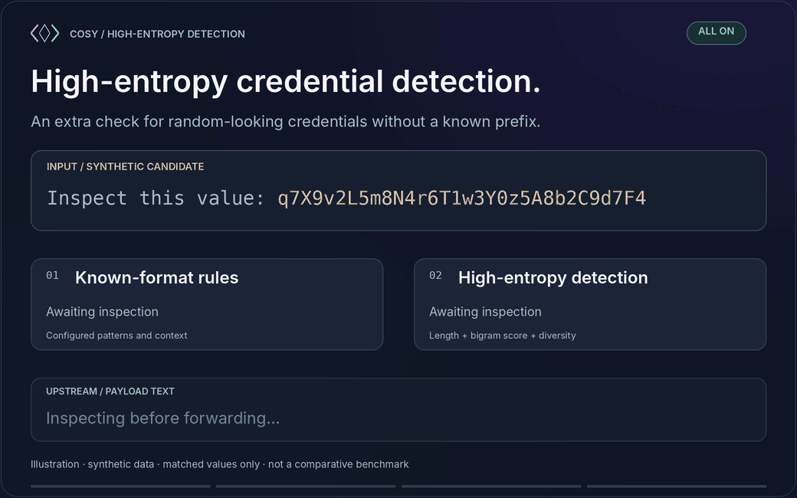
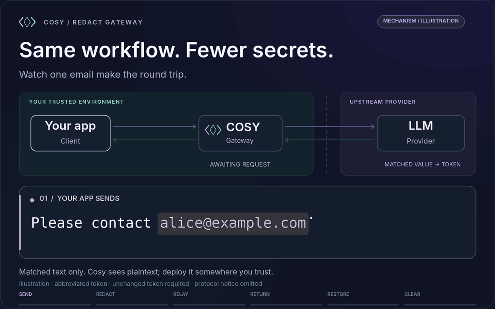
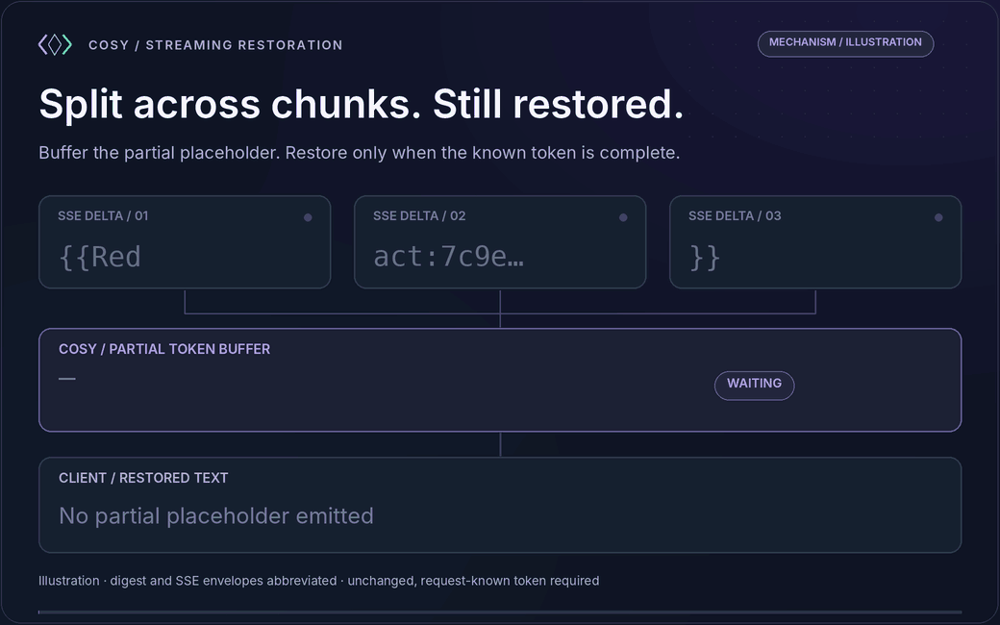

<p align="center">
  <picture>
    <source media="(max-width: 600px)" srcset="docs/readme/hero-mobile-en.svg">
    
  </picture>
</p>

<h1 align="center">Cosy Redact Gateway</h1>

<p align="center"><strong>High-entropy credential detection. Beyond known key formats.</strong></p>

<p align="center">
  <a href="#high-entropy"></a>
  <a href="#quick-start"></a>
  <a href="#compatibility"></a>
  <a href="LICENSE"></a>
</p>

<p align="center">
  <a href="README.md">简体中文</a> · <strong>English</strong>
  <br>
  <a href="#high-entropy">High entropy</a> ·
  <a href="#quick-start">Start locally</a> ·
  <a href="#proof">Verify detection</a> ·
  <a href="#integrations">Connect your app</a> ·
  <a href="#security">Security</a>
</p>

A credential does not need an `sk-` prefix to be sensitive. An internal service token can be a bare random-looking string—inside pasted code, configuration, logs, or a tool result.

**Cosy is a developer-focused LLM redaction gateway built around high-entropy credential detection.** Alongside known key formats, it statistically scores eligible text blocks for random-looking credential candidates, without requiring a provider prefix or an assignment label such as `password=`.

With **all detectors enabled**, high-entropy detection complements structured checks and Gitleaks-compatible secret rules. Matched values become reversible placeholders before forwarding; known, unchanged placeholders are restored in responses, supported SSE streams, and tool-call arguments. The configuration flag for high-entropy detection is `H`.

**For a local-first developer workflow, run Cosy on your machine and route your supported LLM calls through it.** The examples below enable every detector with `/$https://…`.

> **Scope:** this protects matched values in inspected JSON text, not all host traffic. Detection can miss secrets. Upstream authentication is still forwarded. A hosted gateway sees the original request before redaction. [Security boundary →](#security)

<a id="h-layer"></a>
<a id="high-entropy"></a>
## High-entropy credentials do not always come with a label

A known-format rule asks whether text matches a configured pattern. **High-entropy detection also asks whether an eligible block looks unusually unlike ordinary English text.** That gives unlabeled, random-looking credentials another route to detection—even when there is no provider prefix or credential assignment label to match.

| Detection layer | What it adds |
| :--- | :--- |
| **Known formats & structured rules** | Recognize supported provider signatures, credential assignments, and structured personal data. |
| **High-entropy credential detection** | Score ASCII alphanumeric blocks longer than 8 characters using length-aware English bigram cross entropy and a symbol-diversity floor. Numeric-only blocks are excluded. |
| **All on: `HPSIBEG`** | Combine these approaches. An empty flag section enables the full set; it is not a separate “high-entropy-only” mode. |

**The difference is an extra detection path—not a promise that every random string is a credential or that every credential will be caught.** Source and calibration: [`worker.js`](worker.js), [entropy methodology](docs/ENTROPY.md).

<a id="how-it-works"></a>
### Beyond a rule match

<p align="center">
  <picture>
    <source media="(prefers-reduced-motion: reduce) and (max-width: 600px)" srcset="docs/readme/high-entropy-mobile-en-poster.png">
    <source media="(prefers-reduced-motion: reduce)" srcset="docs/readme/high-entropy-en-poster.png">
    <source media="(max-width: 600px)" srcset="docs/readme/high-entropy-mobile-en.gif">
    
  </picture>
</p>

*Mechanism illustration, not a test recording. The credential is synthetic and the placeholder is shortened. No real credential is shown.*

| Stage | Illustrative text |
| :--- | :--- |
| **Your app sends** | `Inspect this value: q7X9v2L5m8N4r6T1w3Y0z5A8b2C9d7F4` |
| **If the value is detected, the upstream sees** | `Inspect this value: {{Redact:…}}` |
| **The model echoes the token** | `The value is {{Redact:…}}` |
| **Cosy restores it for your app** | `The value is q7X9v2L5m8N4r6T1w3Y0z5A8b2C9d7F4` |

The original value is restored only if the model preserves a known placeholder exactly. Real placeholders contain a 64-character SHA-256 digest. Cosy restores tool arguments too, but does **not** execute tools or authorize their actions. [Full round-trip contract →](docs/REFERENCE.en.md#lifecycle)

**Complete redaction and restoration round trip**

<p align="center">
  <picture>
    <source media="(prefers-reduced-motion: reduce) and (max-width: 600px)" srcset="docs/readme/round-trip-mobile-en-poster.png">
    <source media="(prefers-reduced-motion: reduce)" srcset="docs/readme/round-trip-en-poster.png">
    <source media="(max-width: 600px)" srcset="docs/readme/round-trip-mobile-en.gif">
    
  </picture>
</p>

Mechanism illustration using synthetic data. Digests and protocol notices are abbreviated. Restoration requires a known, unchanged placeholder in the current request.

<a id="proof"></a>
## Verify the extra layer

A useful security claim should be inspectable. The repository includes a **local-only, no-API-key demonstration** that calls the repository's own exported detector and redaction functions:

```bash
node scripts/demo-high-entropy.mjs --lang=en
```

It prints the observed result for the same synthetic, unlabeled candidate under **`PSIBEG` (high-entropy detection off), `H` (high-entropy detection only), and empty flags (all on)**. It also checks exact restoration and high-entropy detection's documented exclusions. It uses no network and does not call a model. Results describe these synthetic fixtures only, not production leak rates.

For the project's broader regression and entropy fixtures:

```bash
npm test
npm run entropy-report
```

The repository's published calibration reports **296 / 30,000 natural-word concatenations (0.9867%)** classified as high entropy; random hex/base62 recall increases with length. These are synthetic fixture results, not a production leak rate or an independently reproduced benchmark in this README update. [Methodology](docs/ENTROPY.md) · [High-entropy detection: evidence, verification, and limitations](docs/HIGH-ENTROPY.en.md)

<a id="quick-start"></a>
## Start locally. Turn every detector on.

### 1. Run the gateway on your machine

Use **Node.js 20+**, Git, and a terminal. No gateway runtime dependencies need to be installed. The HTTP example uses Bash and curl 7.76+.

```bash
git clone https://github.com/CassiopeiaCode/CosyRedactGateway.git
cd CosyRedactGateway
npm start
```

The local development adapter listens on `http://127.0.0.1:8787` by default. Keep it bound to loopback for this workflow.

### 2. Check locally, without a provider account

In another terminal, from the same repository directory:

```bash
curl --fail --silent --show-error http://127.0.0.1:8787/healthz
node scripts/demo-high-entropy.mjs --lang=en
```

The first command checks availability; the second exercises synthetic detector fixtures without network access. Neither requires an API key.

### 3. Route a request through the full policy

Export `OPENAI_API_KEY` with your usual secret-management method and `OPENAI_MODEL` as a model available to your account. This is a real upstream call and may incur provider charges.

```bash
: "${OPENAI_API_KEY:?Set OPENAI_API_KEY in this shell first}"
: "${OPENAI_MODEL:?Set OPENAI_MODEL to a model available to your account}"

node --input-type=module -e '
  const payload = {
    model: process.env.OPENAI_MODEL,
    messages: [{
      role: "user",
      content: "Repeat this value exactly: q7X9v2L5m8N4r6T1w3Y0z5A8b2C9d7F4"
    }],
    stream: true
  };
  process.stdout.write(JSON.stringify(payload));
' | curl --fail-with-body --no-buffer \
  -H 'content-type: application/json' \
  -H "authorization: Bearer ${OPENAI_API_KEY}" \
  --data-binary @- \
  'http://127.0.0.1:8787/$https://api.openai.com/v1/chat/completions'
```

**The empty section before `$` enables `HPSIBEG`: all detectors, including high-entropy detection.** Your app receives the original value when a detected value's token is echoed unchanged. Model output is not deterministic. Quote routed URLs in single quotes in shell commands to preserve `$`.

Provider authentication headers are forwarded to the chosen upstream. This example tests protection of content in the request body, not concealment of the key required to authenticate the API call.

<a id="integrations"></a>
## Add the layer to your developer workflow

Keep the upstream API key, model, and request shape. Change the destination to a Cosy route. Your client must preserve the embedded upstream URL and append API paths correctly.

Every route below enables all detectors, including high-entropy detection. Your client must actually send the relevant calls through the gateway.

### OpenAI Python SDK

Install the SDK in **your application environment**, not as a gateway dependency: `python -m pip install openai`. With `OPENAI_API_KEY`, `OPENAI_MODEL`, and the local gateway ready:

```python
import os
from openai import OpenAI

client = OpenAI(
    api_key=os.environ["OPENAI_API_KEY"],
    base_url="http://127.0.0.1:8787/$https://api.openai.com/v1",
)

response = client.responses.create(
    model=os.environ["OPENAI_MODEL"],
    input="Repeat this value exactly: q7X9v2L5m8N4r6T1w3Y0z5A8b2C9d7F4",
)
print(response.output_text)
```

The expected routed path ends in `$https://api.openai.com/v1/responses`. The same base URL can be used for Chat Completions. [SDK configuration reference](https://github.com/openai/openai-python)

<details>
<summary><strong>Anthropic JavaScript SDK</strong></summary>

Install `@anthropic-ai/sdk` in your application. Set `ANTHROPIC_API_KEY` and `ANTHROPIC_MODEL` to an available model, then run this as an `.mjs` file:

```javascript
import Anthropic from '@anthropic-ai/sdk';

const apiKey = process.env.ANTHROPIC_API_KEY;
const model = process.env.ANTHROPIC_MODEL;
if (!apiKey || !model) {
  throw new Error('Set ANTHROPIC_API_KEY and ANTHROPIC_MODEL first.');
}

const client = new Anthropic({
  apiKey,
  baseURL: 'http://127.0.0.1:8787/$https://api.anthropic.com',
});

const message = await client.messages.create({
  model,
  max_tokens: 128,
  messages: [{
    role: 'user',
    content: 'Repeat this value exactly: q7X9v2L5m8N4r6T1w3Y0z5A8b2C9d7F4',
  }],
});
console.log(message.content);
```

The SDK adds `/v1/messages`; do **not** add an extra `/v1` to this base URL. [SDK source and configuration](https://github.com/anthropics/anthropic-sdk-typescript)

</details>

<details>
<summary><strong>IDE assistants, CLI tools, and custom HTTP clients</strong></summary>

For a tool with a configurable API base URL, start from its actual wire protocol:

| API family | Example base URL |
| :--- | :--- |
| OpenAI-style client that appends `/chat/completions` or `/responses` | `http://127.0.0.1:8787/$https://api.openai.com/v1` |
| Anthropic-style client that appends `/v1/messages` | `http://127.0.0.1:8787/$https://api.anthropic.com` |
| Custom HTTP client | Supply the full endpoint after `$`, as in the curl example. |

**Protocol support is not the same as a verified product integration.** Cursor, Claude Code, Codex, and other tools may differ by version, authentication mode, URL handling, and where the request originates. No version-specific end-to-end claim is made here. Verify the outgoing path with synthetic data before routing sensitive work. A remotely executed client cannot reach your machine's `127.0.0.1`.

</details>

<a id="why-cosy"></a>
## More coverage, without replacing your stack

| Design choice | What it means for your stack |
| :--- | :--- |
| **Single-file core** | Inspect or deploy `worker.js`; it uses Web Fetch, Web Streams, and Web Crypto APIs. |
| **Pass-through protocols** | Preserve upstream request shapes instead of converting between API families. |
| **Request-local mappings** | Restore values without a persistent replacement database. |
| **Streaming-aware restoration** | Handle supported text and tool-argument deltas, including tokens split across SSE events and HTTP chunks. |
| **Explicit detector policy** | Choose structured detectors, high-entropy detection, and Gitleaks-compatible rules with URL flags. |
| **MIT licensed** | Read the [license](LICENSE) and [third-party notices](docs/THIRD_PARTY_NOTICES.md); keep the privacy layer in your own stack. |

<a id="detectors"></a>
## Start with every detector; tune with your own fixtures

```text
https://<cosy-host>/<flags>$<full-upstream-url>
```

An **empty flag section enables every detector**. `HPSIBEG` is the explicit all-on form. Unknown letters return HTTP `400` rather than silently changing the policy.

| Flag | Detector | Scope |
| :---: | :--- | :--- |
| `H` | High-entropy credential detection | ASCII alphanumeric blocks longer than 8 characters; length-aware bigram scoring. Numeric-only blocks are excluded. |
| `P` | Phone numbers | PRC mobile numbers and international `+…` forms. |
| `S` | Long `sk-` secrets | `sk-` followed by at least 60 ASCII alphanumeric characters; not every provider key format. |
| `I` | PRC citizen ID | Identity-number candidates with checksum validation. |
| `B` | Bank-card candidates | 13–19 digits with Luhn validation, including common grouped forms. |
| `E` | Email addresses | Email-pattern matches, such as `alice@example.com`. |
| `G` | Gitleaks-compatible rules | The documented rule set contains 218 JavaScript entries, with keywords, secret groups, entropy checks, and allowlists. |

Choose flags for your data, then evaluate false positives and missed matches. A checksum match does not establish that an account or identity is real. `G` is a serverless-compatible evaluator, not a promise of full Gitleaks CLI parity. [Detector details →](docs/REFERENCE.en.md#detectors)

<a id="compatibility"></a>
## Protocols and streaming

| API family | Request handling | Response handling |
| :--- | :--- | :--- |
| **OpenAI Chat Completions** | JSON text redaction + user-message notice | JSON; supported SSE text and tool/function deltas |
| **OpenAI Responses** | String or message-array input + notice | JSON; supported SSE text and function-argument deltas |
| **Anthropic Messages** | Messages + user-message notice | JSON; supported SSE text and partial-JSON tool deltas |
| **Other JSON endpoints** | Generic string redaction; notice only if a supported body family is recognized | Text/JSON restoration; no blanket guarantee for arbitrary streaming schemas |

Cosy does not convert OpenAI requests into Anthropic requests, or vice versa. Non-empty non-JSON request bodies are rejected with HTTP `415` instead of bypassing redaction. Selected control fields, URLs, and image/audio payload fields are excluded to avoid corrupting requests.

### Streaming claims with a test trail

The repository documents tests for **every split position of a 75-byte placeholder**, plus **one-byte HTTP transport chunks**, supported SSE formats, tool/reasoning deltas, and local HTTP/Node adapter integration. Follow the implementation in [`worker.js`](worker.js) and the fixtures in [`test/`](test/).

```bash
npm test
npm run entropy-report
```

The documented entropy fixture classifies **296 of 30,000 natural-word concatenations (0.9867%)** as high entropy. Random hex/base62 recall rises with length. These are **synthetic fixture results, not real-world privacy guarantees, throughput benchmarks, or an independent audit**. [Methodology and reproduction →](docs/ENTROPY.md)

<details>
<summary><strong>Watch a placeholder survive SSE chunk boundaries</strong></summary>

<p align="center">
  <picture>
    <source media="(prefers-reduced-motion: reduce)" srcset="docs/readme/sse-restoration-en-poster.png">
    
  </picture>
</p>

Mechanism illustration, not a live recording. Digests and SSE envelopes are abbreviated. This shows known-token buffering and restoration, not compatibility certification for arbitrary stream schemas.

</details>

<a id="deployment"></a>
## Deploy where you trust the gateway

| Runtime | Entry point | Intended route |
| :--- | :--- | :--- |
| **Cloudflare Workers** | `worker.js` | Module Worker; no application build step |
| **Deno** | `worker.js` | Direct execution or a Deno Deploy entry point |
| **Node.js 20+** | `node-server.mjs` | Local development adapter |

<details>
<summary><strong>Cloudflare Workers</strong></summary>

From the repository directory, with Wrangler and your Cloudflare account configured:

```bash
npm test
npx wrangler deploy
```

`wrangler.toml` already points at `worker.js`. Alternatively, upload it as a module Worker. Configure the upstream allowlist as a **Worker variable**; a local shell variable alone does not configure a deployed Worker.

```text
REDACT_ALLOWED_HOSTS=api.openai.com,api.anthropic.com
```

Add your own upstream hostname when needed. Wrangler is deployment tooling, not a gateway runtime dependency. Before allowing public traffic, also add access control and review [Security](#security).

</details>

<details>
<summary><strong>Deno</strong></summary>

Run in a trusted environment and restrict upstream hosts:

```bash
REDACT_ALLOWED_HOSTS=api.openai.com,api.anthropic.com \
  deno run --allow-net --allow-env worker.js
```

Direct execution calls `Deno.serve(...)` and reads environment variables. The same module can be the entry point of a Deno Deploy project; configure its environment and access controls in that deployment.

</details>

<a id="security"></a>
## Security is a boundary, not a badge

**The gateway is trusted; the upstream is not trusted with matched plaintext.** Original requests, provider credentials, and replacement maps exist inside the gateway runtime. Deploying on a hosted runtime means trusting that host—not keeping processing entirely on your laptop.

| Cosy does | Cosy does not promise |
| :--- | :--- |
| Replace matching text before forwarding | Find every sensitive value or preserve every task's answer quality |
| Keep replacement maps request-local and unpersisted | Cryptographic erasure, anonymous requests, or cross-request restoration |
| Restore unchanged, known response tokens | Recover tokens that a model edits or invents |
| Reject unsupported non-JSON request bodies | Inspect image/audio content or redact every URL, header, or control field |
| Filter proxy/browser identity headers | Hide upstream credentials: `Authorization` and `x-api-key` are forwarded intentionally |

**Before exposing a deployment:** set `REDACT_ALLOWED_HOSTS`, keep private-upstream blocking enabled, and add external authentication/access control. A host allowlist restricts destinations; it does **not** authenticate callers. Review surrounding request logs and retention policies. Do not rely on the built-in hostname checks as a complete network egress or SSRF defense.

Default limits are **16 MiB per request body** and **16,384 unique replacements per request**. Default CORS is `*`; that is not access control. [All runtime settings →](docs/REFERENCE.en.md#settings) · [Existing security policy →](SECURITY.md)

<a id="faq"></a>
## A few important questions

<details>
<summary><strong>Does “keep credentials local” mean no credential ever leaves the host?</strong></summary>

No. It describes the goal of replacing matched values in inspected payload text before forwarding from a local deployment. It is not a host-wide zero-leak guarantee. `Authorization` and `x-api-key` are sent to the upstream by design; skipped fields, missed matches, and traffic bypassing Cosy remain outside that protection. A cloud Worker or remote Deno instance is not your local machine.

</details>

<details>
<summary><strong>Is this encryption or irreversible anonymization?</strong></summary>

Neither. Cosy replaces selected strings with salted-hash identifiers and keeps an in-memory lookup table to reverse the substitution. The surrounding prompt still goes upstream. Hash identifiers do not eliminate all inference or correlation risks.

</details>

<details>
<summary><strong>What does “request-local” mean?</strong></summary>

The plaintext-to-token map belongs to one request and its response stream. It is discarded afterwards. The salt is generated per runtime/isolate, not per request: the same plaintext can produce the same token in that runtime. Tokens from an older request cannot be restored unless the current request establishes the corresponding mapping.

</details>

<details>
<summary><strong>Will my existing workflow behave identically?</strong></summary>

Not necessarily. Matching text is changed, a notice is injected into a supported user message, selected headers are filtered, and only recognized streaming fields receive protocol-specific handling. Redaction can affect tasks that need the original value; false positives can remove useful context. Test your own prompts and tools with synthetic fixtures first.

</details>

<details>
<summary><strong>Can I use a private or local upstream?</strong></summary>

Literal private, loopback, and link-local destinations are blocked by default after hostname normalization. Only disable `REDACT_BLOCK_PRIVATE_UPSTREAMS` in an intentionally trusted private deployment. An allowlist and network-level egress restrictions remain important. [Routing and errors →](docs/REFERENCE.en.md#routing)

</details>

<a id="contributing"></a>
## Help make the boundary better

Useful contributions include detector regression cases, missed-match/false-positive reports, reproducible client integrations, and SSE edge cases. Start an [issue](https://github.com/CassiopeiaCode/CosyRedactGateway/issues) with the runtime, protocol, flags, and a **synthetic or sanitized** reproduction. Never attach real credentials or private prompts. Run `npm test` before submitting a change; follow [SECURITY.md](SECURITY.md) for security-reporting guidance.

### Further reading

[Routing, lifecycle, and runtime settings](docs/REFERENCE.en.md) · [Entropy calibration](docs/ENTROPY.md) · [Source](worker.js) · [Tests](test/) · [Third-party notices](docs/THIRD_PARTY_NOTICES.md)

### Acknowledgements & license

The URL envelope follows [TransformVetter](https://github.com/CassiopeiaCode/TransformVetter)'s `/{config}${upstream-url}` convention; Cosy does not include its protocol-conversion or moderation engine. Some rule signatures derive from Gitleaks; see [third-party notices](docs/THIRD_PARTY_NOTICES.md).

Thanks to the [Linux.do](https://linux.do) community for its support. Released under the [MIT License](LICENSE).

<p align="center"><sub>Your code goes to AI. Your credentials shouldn't. Inspect locally before forwarding.</sub></p>
