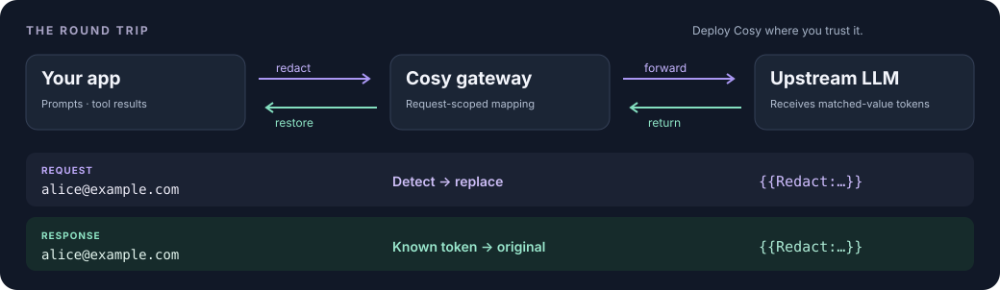

<p align="center">
  <picture>
    <source media="(max-width: 600px)" srcset="docs/readme/hero-mobile.svg">
    
  </picture>
</p>

<h1 align="center">Cosy Redact Gateway</h1>

<p align="center"><strong>Use the upstream you need. Keep the secrets it doesn't.</strong></p>

<p align="center">
  <a href="LICENSE"></a>
  <a href="worker.js"></a>
  <a href="package.json"></a>
  <a href="#security"></a>
  <a href="#compatibility"></a>
</p>

<p align="center">
  <strong>English</strong> · <a href="README.zh-CN.md">简体中文</a>
  <br>
  <a href="#quick-start">Quick start</a> ·
  <a href="#how-it-works">See the round trip</a> ·
  <a href="#integrations">Connect your app</a> ·
  <a href="#security">Security</a> ·
  <a href="docs/REFERENCE.md">Reference</a>
</p>

Cosy is a self-hosted privacy relay for LLM APIs: redact **sensitive text matched by your detectors**, forward the request, and restore unchanged, known placeholders in the response—including supported SSE streams and tool-call arguments.

**One deployable `worker.js`. No database. Zero runtime dependencies.** Cloudflare Workers and Deno for the core; a Node 20+ adapter for local development. Your upstream protocol stays your upstream protocol.

> **Trust boundary:** Cosy sees plaintext. Deploy it somewhere you trust. Detection is not exhaustive, and hosted deployment is not device-local processing. [Read the security model →](#security)

<a id="how-it-works"></a>
## See what leaves your app

An email in a support prompt, a credential in copied configuration, or a sensitive value in a tool result can travel with an otherwise ordinary LLM request. Cosy adds a place to redact matching values before that request reaches the upstream.

<p align="center">
  <picture>
    <source media="(max-width: 600px)" srcset="docs/readme/flow-mobile.svg">
    
  </picture>
</p>

| Stage | Illustrative content |
| :--- | :--- |
| **Your app sends** | `Please contact alice@example.com.` |
| **The upstream sees** | `Please contact {{Redact:…}}.` |
| **The model returns** | `I will contact {{Redact:…}}.` |
| **Your app receives** | `I will contact alice@example.com.` |

The token above is abbreviated for readability; real tokens contain a 64-character SHA-256 digest. The model must preserve the token exactly. The protocol notice is omitted from this illustration. [Full lifecycle →](docs/REFERENCE.md#lifecycle)

<details>
<summary><strong>The same round trip works with tool-call arguments</strong></summary>

```text
Tool result sent by the client
  {"email":"alice@example.com"}

Redacted value sent to the model
  {"email":"{{Redact:…}}"}

Tool-call arguments returned by the model
  {"email":"{{Redact:…}}"}

Arguments delivered to the client
  {"email":"alice@example.com"}
```

Cosy restores the value; it does **not** execute the tool or authorize its action. In a later request, returned tool content is scanned again. Replacement maps do not persist across requests.

</details>

<a id="why-cosy"></a>
## Small by design

| Design choice | What it means for your stack |
| :--- | :--- |
| **Single-file core** | Inspect or deploy `worker.js`; it uses Web Fetch, Web Streams, and Web Crypto APIs. |
| **Pass-through protocols** | Preserve upstream request shapes instead of converting between API families. |
| **Request-local mappings** | Restore values without a persistent replacement database. |
| **Streaming-aware restoration** | Handle supported text and tool-argument deltas, including tokens split across SSE events and HTTP chunks. |
| **Explicit detector policy** | Choose structured detectors, high-entropy detection, and Gitleaks-compatible rules with URL flags. |
| **MIT licensed** | Read the [license](LICENSE) and [third-party notices](THIRD_PARTY_NOTICES.md); keep the privacy layer in your own stack. |

<a id="quick-start"></a>
## Quick start

### 1. Start locally

You need **Node.js 20+**, Git, and a terminal. The HTTP examples use Bash and curl 7.76+; the SDK examples are an alternative. The gateway has no runtime dependencies to install.

```bash
git clone https://github.com/CassiopeiaCode/CosyRedactGateway.git
cd CosyRedactGateway
npm start
```

The development adapter listens on `http://127.0.0.1:8787` by default. Keep that terminal running.

### 2. Check the gateway

In another terminal:

```bash
curl --fail --silent --show-error http://127.0.0.1:8787/healthz
```

Expected JSON response (formatted for readability):

```json
{
  "ok": true,
  "service": "cosy-redact-gateway",
  "route": "/<flags>$<upstream-url>",
  "flags": "HPSIBEG",
  "defaultAll": true
}
```

This checks local availability—not upstream connectivity or detection quality. **No API key is needed for this step.** To run the repository's regression suite, use `npm test` from the project directory.

### 3. Send your first redacted request

Set `OPENAI_API_KEY` in your shell using your usual secret-management method. The Bash example uses `gpt-4.1-mini`; select a model available to your account when adapting it.

```bash
: "${OPENAI_API_KEY:?Set OPENAI_API_KEY in this shell first}"

curl --fail-with-body --no-buffer \
  -H 'content-type: application/json' \
  -H "authorization: Bearer ${OPENAI_API_KEY}" \
  --data '{
    "model": "gpt-4.1-mini",
    "messages": [{
      "role": "user",
      "content": "Repeat this email address exactly: alice@example.com"
    }],
    "stream": true
  }' \
  'http://127.0.0.1:8787/E$https://api.openai.com/v1/chat/completions'
```

`E` enables the email detector only, so the example is easy to inspect. Your client should receive the original email when the model echoes its placeholder unchanged. This is a **real upstream call** and may incur provider charges; model output is not deterministic.

**Enable all detectors:** replace `/E$https://` with `/$https://`. Keep routed URLs in **single quotes in shell commands** so `$` is not expanded.

<a id="integrations"></a>
## Connect your existing app

Keep the upstream API key, model, and request shape. Change the destination to a Cosy route. Your client must preserve the embedded upstream URL and append API paths correctly.

### OpenAI Python SDK

Install the SDK in **your application environment**, not as a gateway dependency: `python -m pip install openai`. With `OPENAI_API_KEY` set and the local gateway running:

```python
import os
from openai import OpenAI

client = OpenAI(
    api_key=os.environ["OPENAI_API_KEY"],
    base_url="http://127.0.0.1:8787/E$https://api.openai.com/v1",
)

response = client.responses.create(
    model="gpt-4.1-mini",
    input="Repeat this email address exactly: alice@example.com",
)
print(response.output_text)
```

The expected routed path ends in `E$https://api.openai.com/v1/responses`. The same base URL can be used for Chat Completions. [SDK configuration reference](https://github.com/openai/openai-python)

<details>
<summary><strong>Anthropic JavaScript SDK</strong></summary>

Install `@anthropic-ai/sdk` in your application. Set `ANTHROPIC_API_KEY` and `ANTHROPIC_MODEL` to an available model, then run this as an `.mjs` file:

```javascript
import Anthropic from '@anthropic-ai/sdk';

const apiKey = process.env.ANTHROPIC_API_KEY;
const model = process.env.ANTHROPIC_MODEL;
if (!apiKey || !model) {
  throw new Error('Set ANTHROPIC_API_KEY and ANTHROPIC_MODEL first.');
}

const client = new Anthropic({
  apiKey,
  baseURL: 'http://127.0.0.1:8787/E$https://api.anthropic.com',
});

const message = await client.messages.create({
  model,
  max_tokens: 128,
  messages: [{
    role: 'user',
    content: 'Repeat this email address exactly: alice@example.com',
  }],
});
console.log(message.content);
```

The SDK adds `/v1/messages`; do **not** add an extra `/v1` to this base URL. [SDK source and configuration](https://github.com/anthropics/anthropic-sdk-typescript)

</details>

<details>
<summary><strong>IDE assistants, CLI tools, and custom HTTP clients</strong></summary>

For a tool with a configurable API base URL, start from its actual wire protocol:

| API family | Example base URL |
| :--- | :--- |
| OpenAI-style client that appends `/chat/completions` or `/responses` | `http://127.0.0.1:8787/E$https://api.openai.com/v1` |
| Anthropic-style client that appends `/v1/messages` | `http://127.0.0.1:8787/E$https://api.anthropic.com` |
| Custom HTTP client | Supply the full endpoint after `$`, as in the curl example. |

**Protocol support is not the same as a verified product integration.** Cursor, Claude Code, Codex, and other tools may differ by version, authentication mode, URL handling, and where the request originates. No version-specific end-to-end claim is made here. Verify the outgoing path with synthetic data before routing sensitive work. A remotely executed client cannot reach your machine's `127.0.0.1`.

</details>

<a id="detectors"></a>
## Choose what to redact

```text
https://<cosy-host>/<flags>$<full-upstream-url>
```

An **empty flag section enables every detector**. `HPSIBEG` is the explicit all-on form. Unknown letters return HTTP `400` rather than silently changing the policy.

| Flag | Detector | Scope |
| :---: | :--- | :--- |
| `H` | High-entropy blocks | ASCII alphanumeric blocks longer than 8 characters; length-aware bigram scoring. Numeric-only blocks are excluded. |
| `P` | Phone numbers | PRC mobile numbers and international `+…` forms. |
| `S` | Long `sk-` secrets | `sk-` followed by at least 60 ASCII alphanumeric characters; not every provider key format. |
| `I` | PRC citizen ID | Identity-number candidates with checksum validation. |
| `B` | Bank-card candidates | 13–19 digits with Luhn validation, including common grouped forms. |
| `E` | Email addresses | Email-pattern matches, such as `alice@example.com`. |
| `G` | Gitleaks-compatible rules | The documented rule set contains 218 JavaScript entries, with keywords, secret groups, entropy checks, and allowlists. |

Choose flags for your data, then evaluate false positives and missed matches. A checksum match does not establish that an account or identity is real. `G` is a serverless-compatible evaluator, not a promise of full Gitleaks CLI parity. [Detector details →](docs/REFERENCE.md#detectors)

<a id="compatibility"></a>
## Protocols and streaming

| API family | Request handling | Response handling |
| :--- | :--- | :--- |
| **OpenAI Chat Completions** | JSON text redaction + user-message notice | JSON; supported SSE text and tool/function deltas |
| **OpenAI Responses** | String or message-array input + notice | JSON; supported SSE text and function-argument deltas |
| **Anthropic Messages** | Messages + user-message notice | JSON; supported SSE text and partial-JSON tool deltas |
| **Other JSON endpoints** | Generic string redaction; notice only if a supported body family is recognized | Text/JSON restoration; no blanket guarantee for arbitrary streaming schemas |

Cosy does not convert OpenAI requests into Anthropic requests, or vice versa. Non-empty non-JSON request bodies are rejected with HTTP `415` instead of bypassing redaction. Selected control fields, URLs, and image/audio payload fields are excluded to avoid corrupting requests.

### Streaming claims with a test trail

The repository documents tests for **every split position of a 75-byte placeholder**, plus **one-byte HTTP transport chunks**, supported SSE formats, tool/reasoning deltas, and local HTTP/Node adapter integration. Follow the implementation in [`worker.js`](worker.js) and the fixtures in [`test/`](test/).

```bash
npm test
npm run entropy-report
```

The documented entropy fixture classifies **296 of 30,000 natural-word concatenations (0.9867%)** as high entropy. Random hex/base62 recall rises with length. These are **synthetic fixture results, not real-world privacy guarantees, throughput benchmarks, or an independent audit**. [Methodology and reproduction →](docs/ENTROPY.md)

<a id="deployment"></a>
## Deploy where you trust the gateway

| Runtime | Entry point | Intended route |
| :--- | :--- | :--- |
| **Cloudflare Workers** | `worker.js` | Module Worker; no application build step |
| **Deno** | `worker.js` | Direct execution or a Deno Deploy entry point |
| **Node.js 20+** | `node-server.mjs` | Local development adapter |

<details>
<summary><strong>Cloudflare Workers</strong></summary>

From the repository directory, with Wrangler and your Cloudflare account configured:

```bash
npm test
npx wrangler deploy
```

`wrangler.toml` already points at `worker.js`. Alternatively, upload it as a module Worker. Configure the upstream allowlist as a **Worker variable**; a local shell variable alone does not configure a deployed Worker.

```text
REDACT_ALLOWED_HOSTS=api.openai.com,api.anthropic.com
```

Add your own upstream hostname when needed. Wrangler is deployment tooling, not a gateway runtime dependency. Before allowing public traffic, also add access control and review [Security](#security).

</details>

<details>
<summary><strong>Deno</strong></summary>

Run in a trusted environment and restrict upstream hosts:

```bash
REDACT_ALLOWED_HOSTS=api.openai.com,api.anthropic.com \
  deno run --allow-net --allow-env worker.js
```

Direct execution calls `Deno.serve(...)` and reads environment variables. The same module can be the entry point of a Deno Deploy project; configure its environment and access controls in that deployment.

</details>

<a id="security"></a>
## Security is a boundary, not a badge

**The gateway is trusted; the upstream is not trusted with matched plaintext.** Original requests, provider credentials, and replacement maps exist inside the gateway runtime. Deploying on a hosted runtime means trusting that host—not keeping processing entirely on your laptop.

| Cosy does | Cosy does not promise |
| :--- | :--- |
| Replace matching text before forwarding | Find every sensitive value or preserve every task's answer quality |
| Keep replacement maps request-local and unpersisted | Cryptographic erasure, anonymous requests, or cross-request restoration |
| Restore unchanged, known response tokens | Recover tokens that a model edits or invents |
| Reject unsupported non-JSON request bodies | Inspect image/audio content or redact every URL, header, or control field |
| Filter proxy/browser identity headers | Hide upstream credentials: `Authorization` and `x-api-key` are forwarded intentionally |

**Before exposing a deployment:** set `REDACT_ALLOWED_HOSTS`, keep private-upstream blocking enabled, and add external authentication/access control. A host allowlist restricts destinations; it does **not** authenticate callers. Review surrounding request logs and retention policies. Do not rely on the built-in hostname checks as a complete network egress or SSRF defense.

Default limits are **16 MiB per request body** and **16,384 unique replacements per request**. Default CORS is `*`; that is not access control. [All runtime settings →](docs/REFERENCE.md#settings) · [Existing security policy →](SECURITY.md)

<a id="faq"></a>
## A few important questions

<details>
<summary><strong>Is this encryption or irreversible anonymization?</strong></summary>

Neither. Cosy replaces selected strings with salted-hash identifiers and keeps an in-memory lookup table to reverse the substitution. The surrounding prompt still goes upstream. Hash identifiers do not eliminate all inference or correlation risks.

</details>

<details>
<summary><strong>What does “request-local” mean?</strong></summary>

The plaintext-to-token map belongs to one request and its response stream. It is discarded afterwards. The salt is generated per runtime/isolate, not per request: the same plaintext can produce the same token in that runtime. Tokens from an older request cannot be restored unless the current request establishes the corresponding mapping.

</details>

<details>
<summary><strong>Will my existing workflow behave identically?</strong></summary>

Not necessarily. Matching text is changed, a notice is injected into a supported user message, selected headers are filtered, and only recognized streaming fields receive protocol-specific handling. Redaction can affect tasks that need the original value; false positives can remove useful context. Test your own prompts and tools with synthetic fixtures first.

</details>

<details>
<summary><strong>Can I use a private or local upstream?</strong></summary>

Literal private, loopback, and link-local destinations are blocked by default after hostname normalization. Only disable `REDACT_BLOCK_PRIVATE_UPSTREAMS` in an intentionally trusted private deployment. An allowlist and network-level egress restrictions remain important. [Routing and errors →](docs/REFERENCE.md#routing)

</details>

<a id="contributing"></a>
## Help make the boundary better

Useful contributions include detector regression cases, missed-match/false-positive reports, reproducible client integrations, and SSE edge cases. Start an [issue](https://github.com/CassiopeiaCode/CosyRedactGateway/issues) with the runtime, protocol, flags, and a **synthetic or sanitized** reproduction. Never attach real credentials or private prompts. Run `npm test` before submitting a change; follow [SECURITY.md](SECURITY.md) for security-reporting guidance.

### Further reading

[Routing, lifecycle, and runtime settings](docs/REFERENCE.md) · [Entropy calibration](docs/ENTROPY.md) · [Source](worker.js) · [Tests](test/) · [Third-party notices](THIRD_PARTY_NOTICES.md)

### Acknowledgements & license

The URL envelope follows [TransformVetter](https://github.com/CassiopeiaCode/TransformVetter)'s `/{config}${upstream-url}` convention; Cosy does not include its protocol-conversion or moderation engine. Some rule signatures derive from Gitleaks; see [third-party notices](THIRD_PARTY_NOTICES.md).

Thanks to the [Linux.do](https://linux.do) community for its support. Released under the [MIT License](LICENSE).

<p align="center"><sub>A small privacy layer. An explicit trust boundary. Your existing LLM stack.</sub></p>
